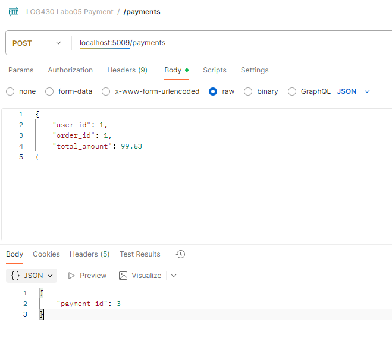
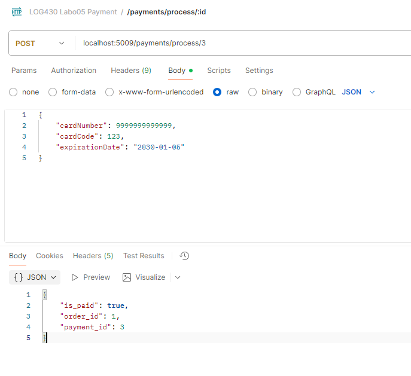
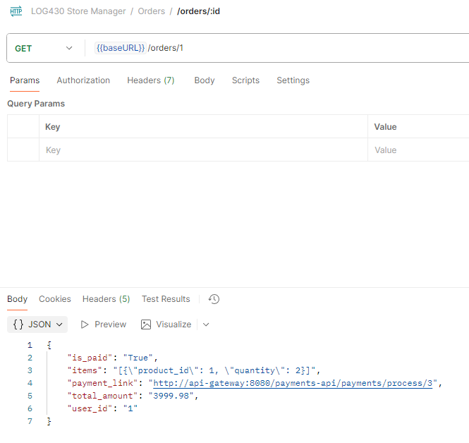
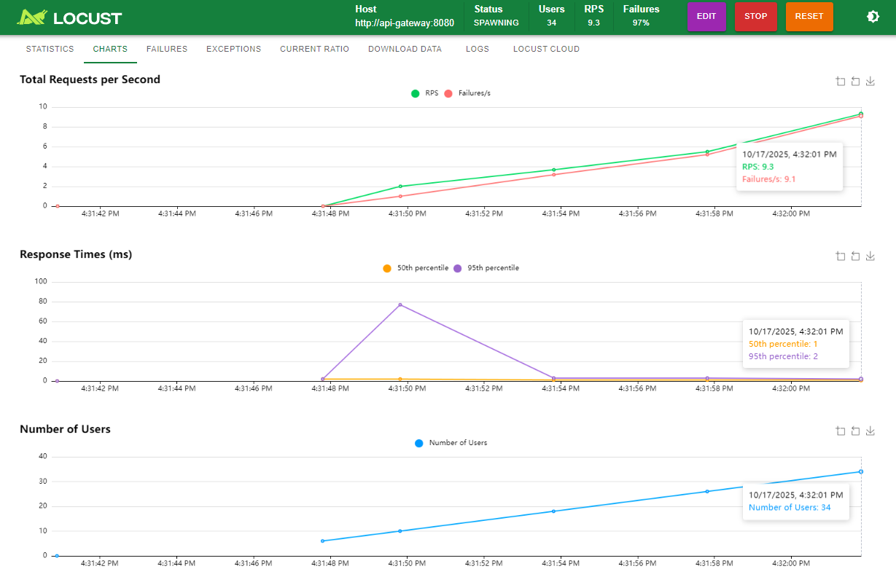
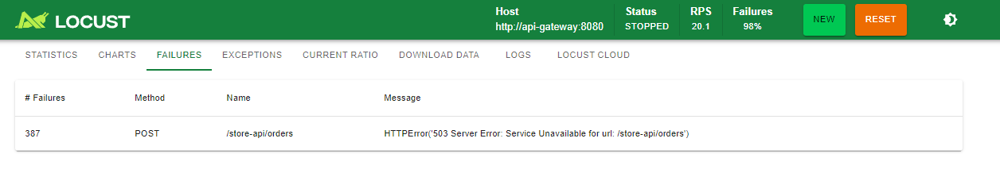
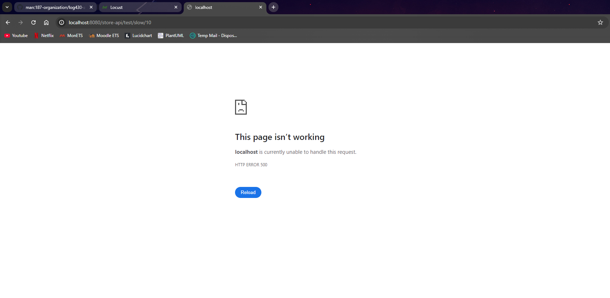
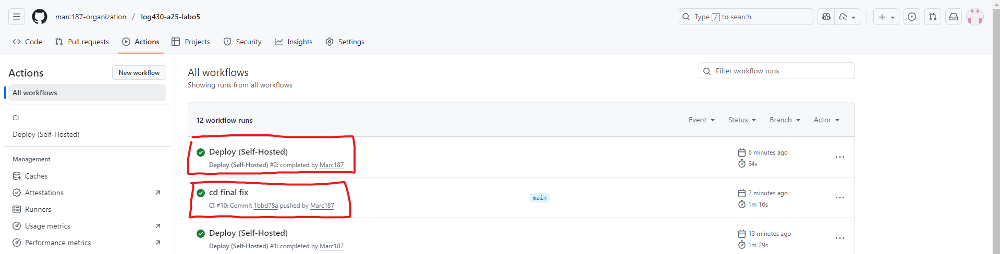
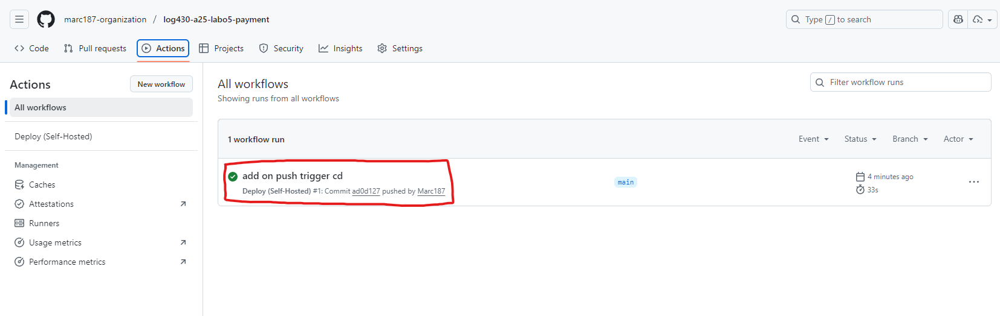
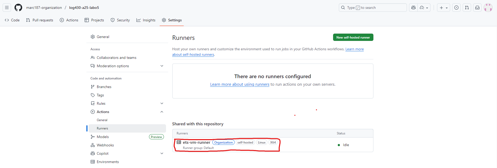
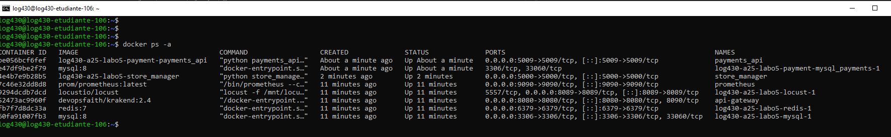

<div align="center">

<center>
<h1 style="font-size:18pt;">
Labo 05 – Microservices, SOA, SBA, API Gateway, Rate Limit & Timeout
</h1>
</center>

<br>
<br>
<br>
<br>

<center>
<h2 style="font-size:16pt;">
PAR
</h2>
</center>

<br>
<br>

<center>
<h2 style="font-size:16pt;">
Marc CHARLEBOIS, CHAM65260301
</h2>
</center>

<br>
<br>
<br>
<br>
<br>
<br>

<center>
<h3 style="font-size:14pt;">
RAPPORT DE LABORATOIRE PRÉSENTÉ À MONSIEUR FABIO PETRILLO DANS LE CADRE DU COURS <em>ARCHITECTURE LOGICIELLE</em> (LOG430-01)
</h3>
</center>

<br>
<br>
<br>
<br>
<br>

<center>
<h3 style="font-size:14pt;">
MONTRÉAL, LE 28 OCTOBRE 2025
</h3>
</center>

<br>
<br>
<br>
<br>
<br>

<center>
<h3 style="font-size:14pt;">
ÉCOLE DE TECHNOLOGIE SUPÉRIEURE<br>
UNIVERSITÉ DU QUÉBEC
</h3>
</center>

<br>
<br>
<br>
<br>
<br>

</div>

---
## **Tables des matières**
- [**Tables des matières**](#tables-des-matières)
  - [**Question 1**](#question-1)
  - [**Question 2**](#question-2)
  - [**Question 3**](#question-3)
  - [**Question 4**](#question-4)
  - [**Question 5**](#question-5)
  - [**Question 6**](#question-6)
  - [**CI/CD**](#cicd)

<br>

---

<div align="justify">

### **Question 1**

> Quelle réponse obtenons-nous à la requête à `POST /payments` ? Illustrez votre réponse avec des captures d'écran/terminal.

La requête `POST /payments` renvoie une réponse JSON qui contient l'identifiant du nouveau paiement qui a été créé : `{ "payment_id": 3 }`



### **Question 2**

> Quel type d'information envoyons-nous dans la requête à `POST payments/process/:id` ? Est-ce que ce serait le même format si on communiquait avec un service SOA, par exemple ? Illustrez votre réponse avec des exemples et captures d'écran/terminal.

Dans la requête `POST /payments/process/:id`, on envoie des informations de carte de crédit (`cardNumber`, `cardCode`, `expirationDate`) en format `JSON`.

Si c’était un service SOA, on utiliserait le format XML, qui est le standard, envoyé dans une enveloppe SOAP décrite par un contrat WSDL, un format plus lourd mais plus structuré que le JSON utilisé ici.



### **Question 3**

> Quel résultat obtenons-nous de la requête à `POST payments/process/:id`?

La requête `POST /payments/process/:id` retourne une réponse confirmant le succès du paiement : `{ "is_paid": true, "order_id": 1, "payment_id": 3 }`.


### **Question 4**

> Quelle méthode avez-vous dû modifier dans `log430-a25-labo05-payment` et qu'avez-vous modifié ? Justifiez avec un extrait de code.

J’ai modifié la méthode `process_payment` afin qu’après la confirmation du paiement, elle refasse un appel `PUT` au API Gateway vers l’endpoint `/store-api/orders`. Cet appel permet de mettre à jour la commande correspondante dans le service Store Manager en ajoutant la variable `is_paid` et la mettant à `true`.

```Python
def process_payment(payment_id, credit_card_data):
    """ Process payment with given ID, notify store_manager sytem that the order is paid """
    # S'il s'agissait d'une véritable API de paiement, nous enverrions les données de la carte de crédit à un payment gateway (ex. Stripe, Paypal) pour effectuer le paiement. Cela pourrait se trouver dans un microservice distinct.
    _process_credit_card_payment(credit_card_data)

    # Si le paiement est réussi, mettre à jour les statut de la commande
    # Ensuite, faire la mise à jour de la commande dans le Store Manager (en utilisant l'order_id)
    update_result = update_status_to_paid(payment_id)
    print(f"Updated order {update_result['order_id']} to paid={update_result}")
    result = {
        "order_id": update_result["order_id"],
        "payment_id": update_result["payment_id"],
        "is_paid": update_result["is_paid"]
    }

    requests.put(
        "http://api-gateway:8080/store-api/orders",
        json=result,
        headers={'Content-Type': 'application/json'}
    )

    return result
```


Comme on le voit ci-dessous, la variable `is_paid` a bien été mise à jour, prouvant le bon fonctionnement de la communication entre les deux services.




### **Question 5**

> À partir de combien de requêtes par minute observez-vous les erreurs 503 ? Justifiez avec des captures d'écran de Locust.

On observe des erreurs 503 presque dès le début, car KrakenD applique la limite `max_rate=10`, `every=1m` sur `POST /store-api/orders`. Comme toutes mes requêtes Locust partent de la même IP, la limite s’applique à l’ensemble du test : le seuil est franchi immédiatement et les 503 apparaissent directement. Les captures Locust confirment le comportement attendu.





### **Question 6**

> Que se passe-t-il dans le navigateur quand vous faites une requête avec un délai supérieur au timeout configuré (5 secondes) ? Quelle est l'importance du timeout dans une architecture de microservices ? Justifiez votre réponse avec des exemples pratiques.

Quand j’appelle une route avec un délai supérieur à 5 secondes, le navigateur affiche une erreur 500 car KrakenD interrompt la requête après le délai configuré (`"timeout": "5s"`). Cela montre que le `timeout` empêche un service lent de bloquer toute la chaîne d’appels.

Dans une architecture de microservices, ce mécanisme est essentiel : il évite les cascades de délais, libère les ressources, et permet au système de rester réactif même si un service devient temporairement lent ou indisponible.



### **CI/CD**

Mon pipeline CI/CD fonctionne ainsi : lors de chaque push ou pull request, mon script CI s’exécute sur GitHub Actions, lance un environnement avec MySQL et Redis, installe les dépendances et exécute les tests pour valider mon code. Si tout est correct, mon script CD se déclenche automatiquement via un runner self-hosted installé sur ma VM, qui récupère le dépôt, génère le fichier .env, construit et démarre les conteneurs avec Docker Compose, puis affiche l’état et les logs pour confirmer le déploiement.

On peut voir ci-dessous que les deux workflows (CI/CD) se sont exécutés correctement pour le `store_manager`, ce qui confirme que l’application a été testée puis déployée sans erreur.


Une étape de CD a aussi été ajoutée pour le repository du `payments_api`. Il n'y avait pas de test dans ce projet alors j'ai gardé celui-ci en un seul workflow, comme on peut le voir ci-dessous, celui-ci a aussi été déployé correctement:



Le déploiement s’effectue sur mon runner auto-hébergé configuré sur la VM, qui exécute directement les commandes Docker.


La commande `docker ps` montre que tous les conteneurs sont bien lancés sur la VM et que l’application est en fonctionnement.
